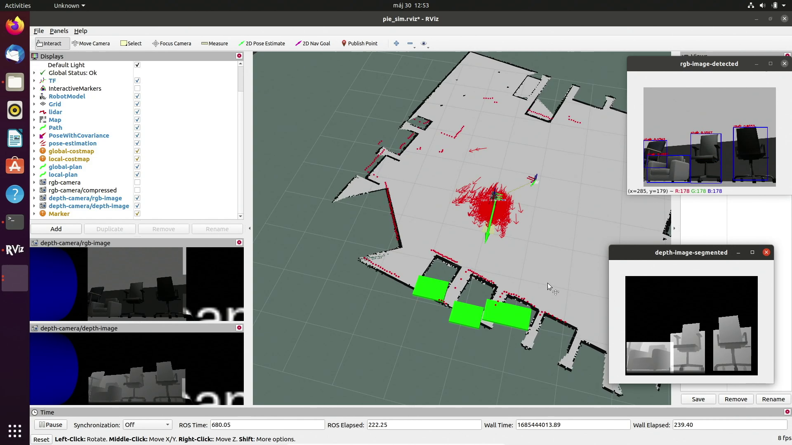

# pie-ai-mapping
Repo for Kognitív robotika 2022-23/II project

Here you can see a screenshot of the main launch file running. Inside it you can see the main rviz window, with the rgb camera image and depth camera image in the lower left, and two other windows, the first one (rgb-image-detected) is based on the rgb camera image, and has the yolo (neural network based object detection system) markers over it, the second one (depth-image-segmented), has the previously said method based objects segmented out. After doing some math on these segmented parts, we can calculate their distances from the robot, and visualize them on the map with green boxes.



There is a demonstration video available on the following link: https://drive.google.com/file/d/11OgUVC9yf6iU42bGFwnFkYwCjL32evN_/view?usp=drive_link


Here you can see that you need to start the test.launch to start the simulation and rviz visualization. You can control the robot with teleop_twist_keyboard.py (it displays the keyboard shortcuts inside the terminal) and the object detection is done with image_detector.py (while it is running, there is some debug information available in the terminal with the object names, mean depth, and the x position of the two sides of the bounding boxes). Pose_enplace.py publishes the visualization_marker topic, which show the approximate location of the currently detected objects.


## Setup and install
1. **Clone repository and update submodules**
    ```
    mkdir -p ~/workspace/src
    cd workspace/src
    git clone https://github.com/turtlewizard73/pie-mapping-and-navigation.git
    git clone https://github.com/turtlewizard73/pie-ai-mapping.git
    ```

2. **Checkout on development and update submodules**
    ```
    cd ~/workspace/src/pie-mapping-and-navigation
    git checkout submit
    git pull
    git submodule update --init --recursive

    cd ~/workspace/src/pie-ai-mapping
    git checkout submit
    git pull
    git submodule update --init --recursive
    ```

3. **Build gazebo actors plugin**
    ```
    cd ~/workspace/src/pie-mapping-and-navigation/gazebo_actor_collisions_plugin
    mkdir -p build
    cd build
    cmake ..
    make
    export GAZEBO_PLUGIN_PATH=$GAZEBO_PLUGIN_PATH:$(pwd)
    ```

4. **Install dependencies and build the packages**
    ```
    cd ~/workspace/src/pie-mapping-and-navigation
    sudo xargs -a apt-dependencies.txt apt install -y

    cd ~/workspace/src/pie-ai-mapping
    sudo xargs -a apt-dependencies.txt apt install -y
    pip3 install -r pip-dependencies.txt

    cd ~/workspace
    catkin_make

    cd ~/workspace/src/yolov7
    pip install -r requirements.txt
    catkin_make --make-args run_tests

    cd ~/workspace
    source devel/setup.bash
    ```
    Follow this guide for tensorflow installation: https://towardsdatascience.com/how-to-finally-install-tensorflow-gpu-on-wsl2-7be59e278f92

    You can use pip as well: https://www.tensorflow.org/install/pip#windows-wsl2_1

5. **Download and load weights**
    ```
    cd ~/workspace/src/pie-ai-mapping/pie_detection/weigths
    wget https://pjreddie.com/media/files/yolov3.weights

    python3 ~/workspace/src/pie-ai-mapping/pie_detection/scripts/convert_weights.py
    ```

## How to use
0. change to correct dir
    ```
    cd ~/workspace
    ```
1. **start the simulation** (gazebo & rviz)
    ```
    roslaunch pie_ai_bringup test.launch
    ```

2. **moving the robot**
    ```
    rosrun teleop_twist_keyboard teleop_twist_keyboard.py
    ```

3. **Start the object and people detection**
    ```
    rosrun pie_detection image_detector.py
    ```

4. **Start displaying markers**
    ```
    rosrun pie_detection pose_enplace.py
    ```
